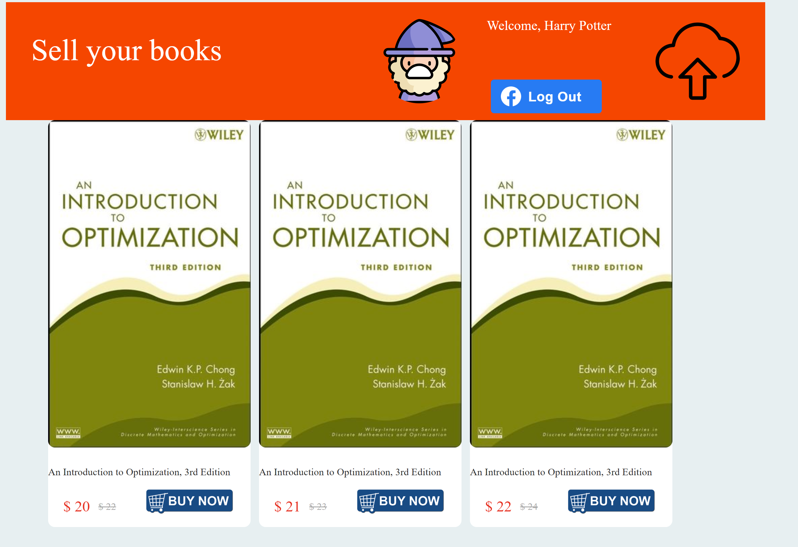
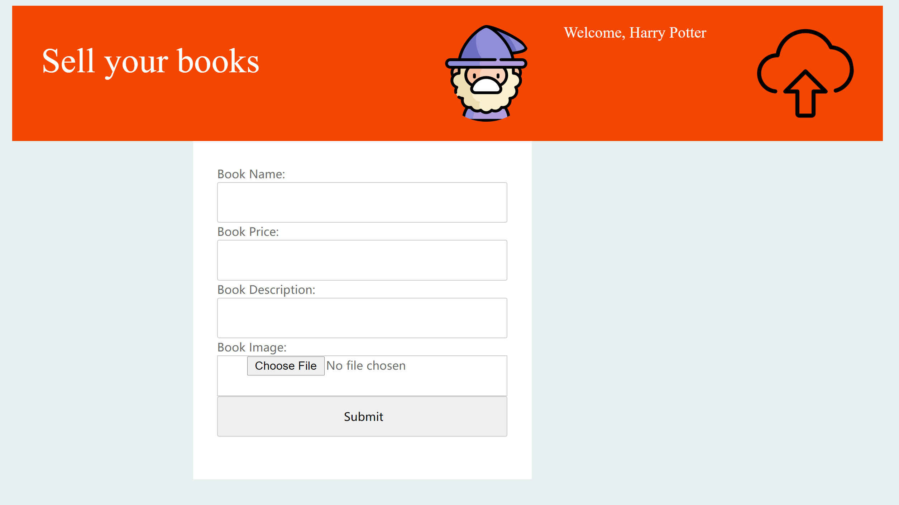
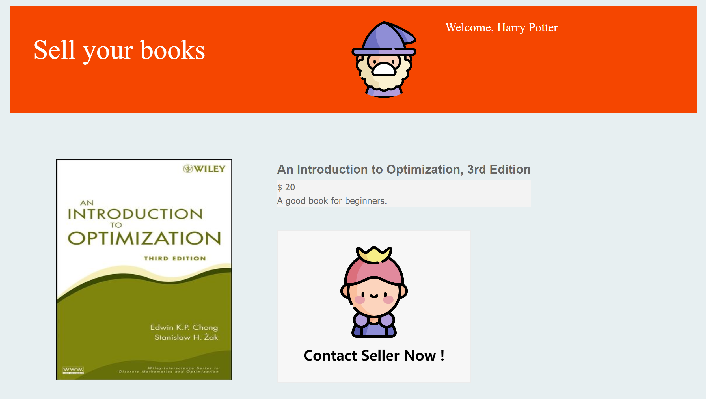

# Book Bridge

This project is designed to provide a platform for people to share books within the same community.

Purchasing books is rather expensive, even if buying used ones is still a big burden. Selling a used book back to
the bookstore usually means lost a fortune. Why not just sell books to your neighbors or your classmates? 

Build with React + Typescript + Facebook + Flask + AWS

###Demo

Login with Facebook to avoid fraud. 
Get customized book recommendation with AWS Personalize.

Post message to sell your own book.

Contact the owner for further information.
